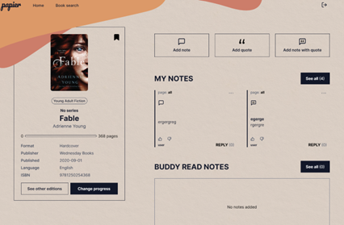
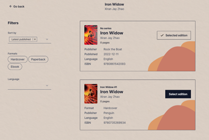
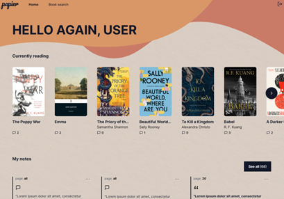

# Book annotating app

This app allows users to add notes to any page in a book. It also provides social features such as buddy reads and responding to public notes.

## Views

### Home page
- section with most popular books
- search bar
- database of all books that can be filtered by book categories

### Book page
- section with all the book's information
- section allowing user to add a note
- sections with notes for the book grouped by access to a notes

### Add a note
- possibility to add a quote, note or note with quote
- change access to note for public, private or buddy

### Note page
- see the whole content of the note
- see all the replies for the note
- reply to a note

### Editions page
- section with all editions of the book
- possibility to filter editions

### User dashboard
- section of all the books that user is currently reading
- section of all the the user's notes
- section containing all the saved books

## Adding new book to database
- possibility to add a book via ISBN number or manually 

    

## Built with

- React
- Java
- Spring Boot
- JavaScript - ES6
- SCSS
- Semantic HTML5 markup
- Flexbox